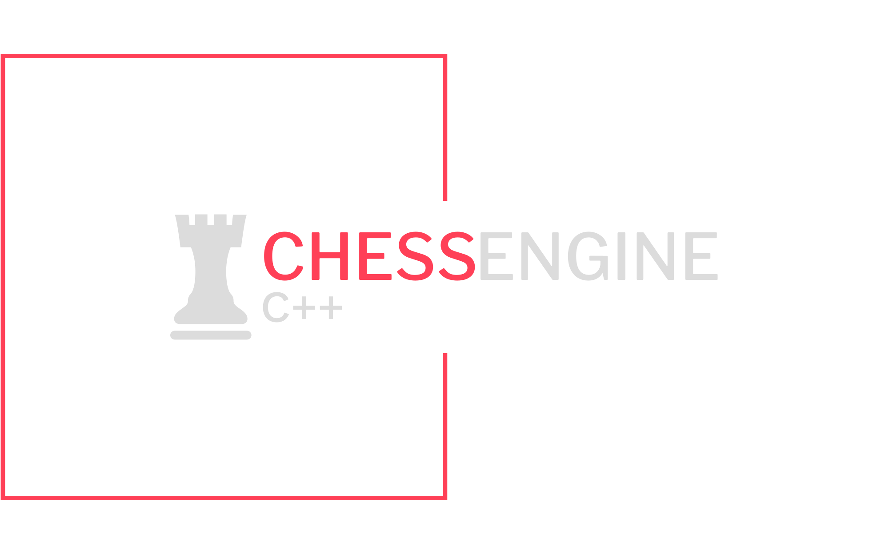

		 
		

				
		

		 
		

				
		

# WELCOME TO :chess_pawn:C++ CHESS ENGINE

### GAME MODES
- Player vs AI
- Player vs Player
- AI vs AI

### INSTALLATION
> **Note**
> Installation package is for Linux Mint, Ubuntu and Debian

>[INSTALLATION PACKAGE](https://github.com/TVS-Ltd/ProjectChess/releases/download/v.0.0.5/chessEngine-v.0.0.5.deb)

> **Warning**
> To compile source code you have to use C++20 standard or later.

>[SOURCE CODE](https://github.com/TVS-Ltd/ProjectChess/tree/master/src)
